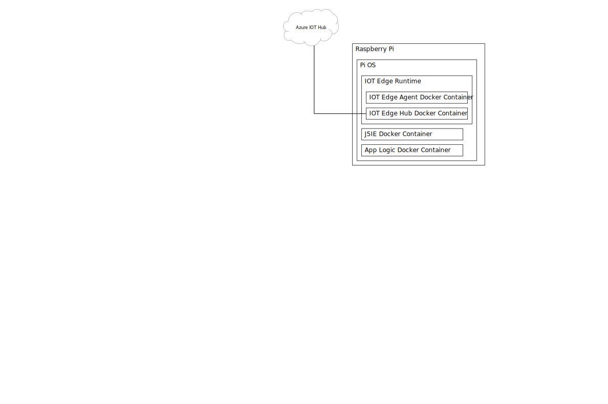

# Johnny-Five on IoT Edge
An IoT Edge module for interacting with hardware based on http://johnny-five.io/

# Introduction
[Johnny-Five](http://johnny-five.io/) is a popular open soure JavaScript platform for IoT and Robotic development giving various IoT hardware devices a consistent programming interface.  This module enables connectivity between [Iot Edge](https://azure.microsoft.com/en-us/services/iot-edge) and Johhnny-Five so Robotic and IoT developers can use the cloud to configure and communicate with devices in a consistent way without device-specific coding.

# Components

## Microsoft Azure IoT Hub (Cloud)
## Microsoft Azure IoT Edge (Device)

# Example
[The example](examples/readme.md) demonstrates a configuration that would be applied to a Raspberry Pi with a LED, a button, a temperature sensor, and a mini OLED display.

The IoT device is configured via .JSON file that defines the state of each of the components that are connected to the device, like LEDs, buttons, sensors, and displays.  
## Example payload
This payload defines a thermometer controller "MCP9809", a LED at pin PI-7, and a LED at pin PI-9.

    {
        peripherals: [{
        type: "Thermometer",
        name: "motor1thermometer",
        settings: {
          controller: "MCP9808"
        },
        outputAlias: "alias1"
      }, {
        type: "Led",
        name: "alarm1",
        settings: {
          pin: "P1-7"
        },
        outputAlias: "alias2"
      }, {
        type: "Led",
        name: "alarm2",
        settings: {
        pin: "P1-9"
        },
        outputAlias: "alias1"
      }]
    }
  

# License

MIT License

Copyright (c) 2018 Johnny-Five IoT Edge contributors

Permission is hereby granted, free of charge, to any person obtaining a copy
of this software and associated documentation files (the "Software"), to deal
in the Software without restriction, including without limitation the rights
to use, copy, modify, merge, publish, distribute, sublicense, and/or sell
copies of the Software, and to permit persons to whom the Software is
furnished to do so, subject to the following conditions:

The above copyright notice and this permission notice shall be included in all
copies or substantial portions of the Software.

THE SOFTWARE IS PROVIDED "AS IS", WITHOUT WARRANTY OF ANY KIND, EXPRESS OR
IMPLIED, INCLUDING BUT NOT LIMITED TO THE WARRANTIES OF MERCHANTABILITY,
FITNESS FOR A PARTICULAR PURPOSE AND NONINFRINGEMENT. IN NO EVENT SHALL THE
AUTHORS OR COPYRIGHT HOLDERS BE LIABLE FOR ANY CLAIM, DAMAGES OR OTHER
LIABILITY, WHETHER IN AN ACTION OF CONTRACT, TORT OR OTHERWISE, ARISING FROM,
OUT OF OR IN CONNECTION WITH THE SOFTWARE OR THE USE OR OTHER DEALINGS IN THE
SOFTWARE.
